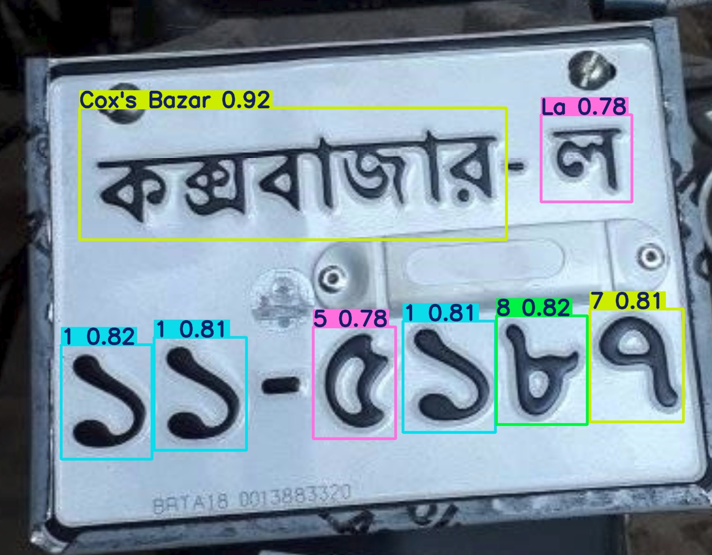

# 🇧🇩 Bangla License Plate Character Detector (YOLOv8)

[](LICENSE)  
[](https://www.python.org/)  
[](https://github.com/ultralytics/ultralytics)

Detects individual Bangla characters on license plates using **YOLOv8**, forming a crucial step in Bangladeshi LPR systems.

---

## 📷 Demo / Example

  


---

## 📑 Table of Contents

- [✨ Features](#-features)  
- [🚀 Getting Started](#-getting-started)  
- [🛠 Installation](#-installation)  
- [🗂 Dataset](#-dataset)  
- [🏋️ Training](#-training)  
- [🔮 Prediction](#-prediction)  
- [🗃 Project Structure](#-project-structure)  
- [📊 Results and Artifacts](#-results-and-artifacts)  
- [📜 License](#-license)  
- [📫 Contact](#-contact)  

---

## ✨ Features

- **YOLOv8-based Detection:** Robust and efficient character detection.  
- **Bangla Character Focus:** Specifically trained for Bangla script.  
- **Custom Training Script:** `main.py` for customizable training.  
- **Inference Script:** `predict.py` for running predictions.  
- **Comprehensive Outputs:** F1 curves, confusion matrix, batch predictions, metric plots.  
- **Pre-trained Weights:** `best.pt` included for immediate inference.  

---

## 🚀 Getting Started

### Prerequisites

- Python 3.8+  
- NVIDIA GPU (recommended) with CUDA support  

---

## 🛠 Installation

1. **Clone the repository:**

```bash
git clone https://github.com/samin2703/Bangla_license_plate_project.git
cd Bangla_license_plate_project
